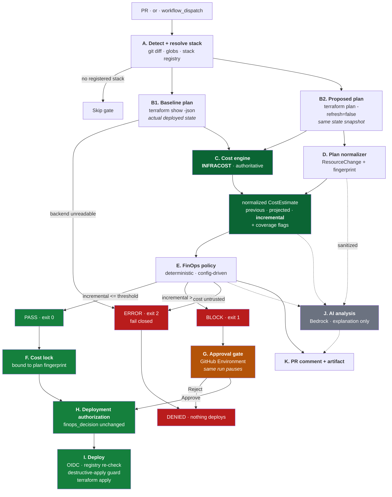

# Shift-Left FinOps — Terraform Cost Governance

Evaluates the cost of an infrastructure change **before** it is applied, applies a deterministic FinOps policy, pauses for human approval when the change exceeds the threshold, and only then authorises `terraform apply`.

The cost engine is cloud-agnostic and is exercised against **AWS, Azure and GCP** plan JSON. Governed **deployment** is AWS-only today. Cost figures come from **Infracost**; AI only explains them.

```
change → terraform plan (deployed state = baseline) → Infracost → incremental monthly cost
    → FinOps policy → PASS  → cost lock → deploy
                     → BLOCK → human approval → authorized → deploy
                     → ERROR → fail closed, nothing deploys
```

Two entry points, one governance chain:

| | Trigger | Baseline |
|---|---|---|
| **Greenfield** | `workflow_dispatch` on a registered stack | No deployed state → **$0** |
| **Brownfield** | Pull request touching a registered stack | **The actual deployed state** |

**Status:** working POC. 331 tests pass. Governed deploy + approval + destroy verified end-to-end on AWS `dev` against two independent workloads — `web-platform` and `ecommerce-platform` (69 resources) — under the shared full-access deploy-role model, with no workload-specific IAM permissions added for either.

---

## Contents

- [Results](#results)
- [Architecture](#architecture)
- [Greenfield and brownfield](#greenfield-and-brownfield)
- [How it works](#how-it-works)
- [Stack registry](#stack-registry)
- [Onboarding a new workload](#onboarding-a-new-workload)
- [Approval and deployment authorization](#approval-and-deployment-authorization)
- [Why Infracost](#why-infracost)
- [Quick start](#quick-start)
- [Configuration](#configuration)
- [The threshold](#the-threshold)
- [Cost lock](#cost-lock)
- [AI layer](#ai-layer)
- [Failure semantics](#failure-semantics)
- [CI/CD](#cicd)
- [Testing](#testing)
- [Security](#security)
- [Repository layout](#repository-layout)
- [Known limitations](#known-limitations)
- [Next steps](#next-steps)

---

## Results

Offline multi-cloud policy scenarios, threshold `USD 100/month`, live Infracost CLI v2.16.2:

| Cloud | Scenario | Previous | Projected | Incremental | Result | Exit |
|---|---|---:|---:|---:|:---:|:---:|
| aws | pass | 9.19 | 74.08 | **64.89** | PASS | 0 |
| aws | fail | 9.19 | 409.17 | **399.98** | FAIL | 1 |
| azure | pass | 9.99 | 74.88 | **64.89** | PASS | 0 |
| azure | fail | 9.99 | 874.05 | **864.06** | FAIL | 1 |
| gcp | pass | 26.46 | 61.72 | **35.26** | PASS | 0 |
| gcp | fail | 26.46 | 831.39 | **804.93** | FAIL | 1 |

Reproduce: `python scripts/demo.py` (live) or `python scripts/demo.py --fixtures` (offline).

> These scenarios prove the **policy engine** is cloud-agnostic. The **governed pipeline** — real remote-state baseline, approval gate, OIDC apply — runs on AWS only, and pins Infracost **0.10.45** in CI. Both CLI schemas are supported; see [step 4](#4-cost-estimation--infracost).

---

## Architecture



**The cost path is cloud-agnostic.** The only cloud-aware logic is a resource-type prefix mapping (`aws_` / `azurerm_` / `google_`) used for grouping and reporting — never for money. There are no SKU tables, region multipliers or per-cloud pricing modules in this repository.

---

## Greenfield and brownfield

Both run the **identical** job chain, the identical policy and the identical approval gate. The only thing that differs is what the baseline is.

| | Greenfield | Brownfield |
|---|---|---|
| **Meaning** | The stack is not deployed yet | The stack is already deployed; the change is incremental |
| **Trigger** | `workflow_dispatch` — pick a registered stack + environment | Pull request touching the stack's registered paths |
| **Baseline** | Backend reachable, no state object → empty → **$0** | `terraform show -json` of the **live remote state** |
| **Proposed** | Every resource plans as `create` | Plan against that same state snapshot |
| **Gated number** | Full monthly cost of the new stack | Only the **delta** the change introduces |
| **Approval** | Same gate, same threshold | Same gate, same threshold |

There is deliberately **no "is this the first deployment?" branch** in the code. An empty deployed state and a non-existent one cost the same, so greenfield falls out of the brownfield path for free.

### Why the baseline is deployed state, not the base branch

Earlier revisions planned the base branch and called that the baseline. That was wrong in two ways:

1. **Git history ≠ deployment history.** A stack can be deployed by an earlier, still-open PR before it is ever merged. Comparing against the base ref priced an already-deployed stack as if it were brand new.
2. **Empty-state plans misprice.** Planning from empty state leaves references such as an autoscaling group's `launch_template.id` "known after apply", so Infracost cannot attach them and prices them at **$0**. Measured on `web-platform/dev`: a `t3.large` → `t3.xlarge` upgrade was reported as a **$66.04/mo saving** instead of a **$60.74/mo increase**.

Both documents are now produced from the **same real backend and the same state snapshot** with `-refresh=false`, so a resource the change does not touch prices identically on both sides and cancels out of the delta.

> **Fail closed.** A registered stack always has a real remote backend, so "could not read the backend" never means "nothing is deployed" — it means the deployed cost is **unknown**. There is no local-backend fallback: the job fails, no lock is minted and nothing deploys.

---

## How it works

### 1. Change detection and stack resolution
`finops detect-changes --base <ref>` runs `git diff --name-only` and matches against `change_detection.infrastructure_globs`. Matched files are then resolved to **registered stacks** via [config/finops-stacks.yml](config/finops-stacks.yml). A docs-only PR skips the gate entirely, and a change that maps to no registered stack evaluates nothing — there is deliberately **no default stack**.

A `workflow_dispatch` run skips the diff and names one registered stack directly; it is still resolved against the same registry, and the requested environment must match the one the stack is registered for.

### 2. Two plans, one state snapshot
Both documents are produced from the stack's **real remote backend**, in a checkout that has only ever been `init`ed against that backend:

```bash
# Baseline = what is ACTUALLY deployed right now.
# No plan argument: a pure read of the state object. No refresh, no provider calls.
terraform show -json > state.json        # -> state_json_to_plan_json() -> baseline-plan.json

# Proposed = the same stack after this change, from the SAME state snapshot.
terraform plan -lock=false -refresh=false -out=proposed.tfplan
terraform show -json proposed.tfplan > proposed-plan.json
```

`-refresh=false` is what makes the subtraction honest: both sides read the identical state values, so untouched resources price identically and cancel out. `-lock=false` means the gate can never contend with a concurrent deploy's state lock.

[src/finops/plan/state_shim.py](src/finops/plan/state_shim.py) reshapes the state document into the plan-shaped JSON Infracost expects. It is a faithful reshape of real Terraform data — it never fabricates a cost.

### 3. Plan normalization
`plan.json` becomes a cloud-agnostic `ResourceChange[]` plus a **plan fingerprint** (SHA-256 over the sorted, cost-relevant change set). Terraform's `["delete","create"]` collapses to `replace`; data sources and no-ops are dropped.

### 4. Cost estimation — Infracost
Infracost prices both plan JSONs; the engine subtracts:

```
incremental_monthly_cost = cost(proposed plan) − cost(baseline plan)
```

> **Why two runs?** Verified against CLI v2.16.2: `infracost scan` produces a *breakdown only* and has no `--compare-to` flag (`infracost scan --help`). The classic `diffTotalMonthlyCost` field belongs to the v0.10 schema. The two-run subtraction is identical on both CLI lines and maps exactly onto "incremental cost introduced by this PR".

The parser handles **both** Infracost schemas and auto-detects which:

| CLI | Command | Schema |
|---|---|---|
| v2 (default) | `infracost scan <plan.json> --json` | snake_case: `summary.total_monthly_cost`, `projects[].resources[].cost_components[]` |
| v0.10 | `infracost breakdown --path <plan.json> --format json` | camelCase: `totalMonthlyCost`, `projects[].breakdown.resources[].costComponents[]` |

All Infracost money fields are JSON **strings or `null`**. They are parsed with `Decimal`, and `null` is treated as *unpriced* — never coerced to `0`.

### 5. Policy → 6. Lock → 7. Approval → 8. Deploy
Covered below.

---

## Stack registry

[config/finops-stacks.yml](config/finops-stacks.yml) is the **only** source of Terraform directories, deployability and state keys. Nothing in it may be supplied by a pull request.

```yaml
stacks:
  web-platform:
    terraform_dir: terraform/workloads/web-platform
    cloud: aws
    deployable: true
    environment: dev
    state_key: finops-poc/dev/web-platform/terraform.tfstate
    usage_file: terraform/workloads/web-platform/infracost-usage.yml
    paths:
      - terraform/workloads/web-platform/
```

| Field | Purpose |
|---|---|
| `terraform_dir` | The Terraform root to plan and apply |
| `paths` | Changed-file prefixes that select this stack |
| `cloud` | Used for grouping and reporting only |
| `environment` | The GitHub Environment (and its protection rules) the deploy runs in |
| `state_key` | The exact remote state object baselined **and** applied |
| `deployable` | `false` → priced and reported, but **can never mint a cost lock or be applied** |
| `usage_file` | Infracost usage assumptions for consumption-priced resources |

Why this matters:

- A PR **cannot** point the gate at an arbitrary Terraform directory, mark itself deployable, or redirect a stack at a different GitHub Environment.
- The deploy job **re-reads the registry file itself** on the trusted ref and re-checks `deployable`, `environment` and `state_key` before any Terraform command runs — so deployability is enforced twice, independently.
- Because `state_key` drives both the baseline read and the apply, the gated baseline and the applied state are provably the **same object**.

> `web-platform` declares a `usage_file` because S3, CloudFront and CloudWatch bill on consumption — Terraform alone cannot price them, and without it those resources price at zero and understate the bill.

Currently registered: `aws` (synthetic scenario stack), `web-platform` (three-tier workload: Route 53 → CloudFront → ALB → ASG/EC2 → RDS, plus S3, CloudWatch, IAM and VPC) and `ecommerce-platform` (12-module, 69-resource workload: networking, ALB, storefront/worker ASGs, RDS, ElastiCache, S3, CloudFront, Route 53, SQS, Secrets Manager, CloudWatch and workload IAM).

---

## Onboarding a new workload

Full walkthrough: [docs/ONBOARDING-NEW-WORKLOAD.md](docs/ONBOARDING-NEW-WORKLOAD.md). Short version for a workload in **this repository, this AWS account**:

1. Add the Terraform root under `terraform/workloads/<name>/`.
2. Register it in `config/finops-stacks.yml` (`terraform_dir`, `state_key`, `environment`, `deployable`, `usage_file` if it has consumption-priced resources).
3. Run the existing FinOps Cost Gate against it — no other pipeline change is needed.

Once the shared backend is provisioned in an AWS account, new Terraform workloads can be onboarded without adding workload-specific IAM permissions to the shared deployment role — see [Security](#security) for the full-access design this relies on and its boundaries. Onboarding still requires the workload to be registered and configured in the stack registry above; nothing is automatic beyond that.

This only covers a new workload in the same repository and account. A workload in a **different GitHub repository** needs the pipeline files brought into that repository *and* its OIDC subject explicitly added to the deploy/plan roles' trust policy — copying the workflow files alone is not sufficient. A **different AWS account** needs the shared backend (state bucket, OIDC provider, plan/deploy roles) provisioned there first. Both are covered in the onboarding doc.

---

## Approval and deployment authorization

The pipeline reports **three deliberately separate signals**. Conflating them is the mistake this design exists to prevent.

| Signal | Question it answers | Values |
|---|---|---|
| `finops_decision` | Was this change within budget? | `PASS` / `BLOCK` |
| `approval_status` | Has a human decided? | `NOT_REQUIRED` / `PENDING` / `APPROVED` / `REJECTED` |
| `deployment_authorization` | May this actually deploy? | `AUTHORIZED` / `DENIED` |

**An approval never rewrites the decision.** An approved overspend is still a `BLOCK`; only `deployment_authorization` moves.

```
PASS  + lock verified        → BLOCK? no    approval NOT_REQUIRED   AUTHORIZED
BLOCK + approved             → BLOCK        approval APPROVED       AUTHORIZED
BLOCK + rejected             → BLOCK        approval REJECTED       DENIED
BLOCK + no decision yet      → BLOCK        approval PENDING        DENIED
ERROR (cost untrusted)       → BLOCK        approval PENDING        DENIED
```

### How approval actually works

The gate uses a **GitHub Actions Environment protection rule** (`finops-cost-approval`) — the native equivalent of a Jenkins `input` step:

1. On `BLOCK`, the workflow posts the figures to the PR: current cost, projected cost, **incremental cost**, threshold, plus the AI summary and explicit approve/reject instructions.
2. The `finops-approval` job requests the `finops-cost-approval` Environment. **This same run pauses** — status becomes *Waiting*.
3. GitHub only starts that job's steps once the required reviewer clicks **Approve** on this exact run. A **Reject** means the steps never execute at all, so no authorization is ever produced.
4. The approval job consumes **only the artifact this same run already produced**. It never re-plans, never re-prices, never re-runs Terraform or Infracost, never touches AWS.
5. The approval is bound to that exact commit. Any new commit — or a re-dispatch — invalidates it and starts a fresh evaluation.

There is no "record a rejection" code path by design: GitHub's own gate *is* the rejection handling, and it happens before any step can run. No actor check is duplicated in the steps either — GitHub will not start them unless the required reviewer already approved.

> `cost-gate` legitimately *fails* on a `BLOCK`, so every downstream job uses `always()` and depends on the explicit aggregated authorization result — never on `cost-gate`'s raw pass/fail.

---

## Why Infracost

| Criterion | Infracost | Native pricing APIs | Hand-maintained price book |
|---|---|---|---|
| Terraform plan → cost | Native | Build it yourself ×3 | Build it yourself ×3 |
| Multi-cloud, one interface | AWS + Azure + GCP | One API per cloud | One table per cloud |
| Resource coverage | 1,100+ | Raw SKUs, no resource mapping | Whatever you hand-write |
| Price freshness | Maintained upstream | Live | Stale within weeks |
| Coverage signal | Explicit (`is_supported`, `priceNotFound`) | None | None |
| Cost | **Free tier: 1,000 runs/month** | Free | "Free", high maintenance |
| Licence | Apache-2.0 | — | — |

Sources: [pricing](https://www.infracost.io/pricing/) · [FAQ](https://www.infracost.io/docs/faq/) · [plan JSON docs](https://www.infracost.io/docs/features/terraform_plan_json/) · [JSON schema](https://github.com/infracost/infracost/blob/master/schema/infracost.schema.json) · [repo](https://github.com/infracost/infracost)

The hard part of cloud pricing is translating `aws_instance` + `instance_type` + `root_block_device` + tenancy + OS into the right SKUs, for every resource type, in three clouds. Infracost already solves that. Native pricing APIs return raw SKU price points and would require rebuilding it three times.

> **Prospective vs. actual.** Infracost and the native *pricing* APIs return **list prices for a proposed change**. AWS Cost Explorer / Azure Cost Management / GCP Billing Export return **actual historical spend**. This gate is prospective and never uses an actual-cost API as a pricing engine.

---

## Quick start

### Prerequisites

| Tool | Version | Needed for |
|---|---|---|
| Python | ≥ 3.10 | The engine |
| Terraform | ≥ 1.5 | Generating plan JSON |
| Infracost CLI | v2.x (or v0.10.x) | Cost estimation |

### Install

```bash
git clone <repo> && cd "FinOps Cost Engine POC"
pip install -e ".[dev]"
```

Install Infracost and get a **free** API key:

```bash
# macOS: brew install infracost | Windows: choco install infracost
# Linux: curl -fsSL https://raw.githubusercontent.com/infracost/cli/master/scripts/install.sh | sh
infracost auth login
infracost org switch <your-org>
```

> Infracost has disabled GitHub/Google signup — register with email + password at [dashboard.infracost.io](https://dashboard.infracost.io) first.

### Run the demo

```bash
python scripts/demo.py              # all 6 scenarios, live Infracost
python scripts/demo.py --fixtures   # offline, replays golden fixtures
```

### Run a single gate

```bash
finops analyze \
  --plan          examples/plans/aws-pass.json \
  --baseline-plan examples/plans/aws-baseline.json \
  --commit "$(git rev-parse HEAD)" \
  --execution-id  local-001
```

### Regenerate plan JSON from Terraform

```bash
python scripts/generate_plans.py --cloud all       # AWS + GCP plan offline
python scripts/synthesize_azure_plans.py           # Azure (see limitations)
python scripts/capture_fixtures.py                 # refresh golden fixtures
```

### CLI

| Command | Purpose |
|---|---|
| `finops detect-changes --base <ref>` | Does this change touch infrastructure, and which stacks? |
| `finops analyze --plan <p> [--baseline-plan <b>]` | Run the gate (exit 0/1/2) |
| `finops normalize-plan --plan <p>` | Inspect the normalized change set |
| `finops verify-lock --lock <l> --plan <p>` | Is this lock still valid for this plan? |
| `finops authorize-deployment --exit-code <n>` | Compute the three authorization signals |
| `finops approve --action approve\|reject ...` | Record a human decision for a `BLOCK`ed evaluation |
| `finops approval-verify --approval <a> ...` | Re-verify an approval against a fresh plan and estimate |
| `finops create-exception ...` | Create a peer-approved budget exception |
| `finops verify-exception ...` | Re-validate an exception (author, allowlist, expiry, ceiling) |

Useful `analyze` flags:

| Flag | Effect |
|---|---|
| `--baseline-plan <b>` | Baseline document. Omit for a greenfield stack. |
| `--require-baseline` | Fail closed if no baseline document was produced at all |
| `--stack <name>` | Bind the evaluation (and any lock) to one registered stack |
| `--no-cost-lock` | Never write a lock — used for non-deployable stacks |
| `--markdown` / `--json` | Emit the PR comment, or the machine-readable result |

---

## Configuration

All policy lives in [config/finops-policy.yaml](config/finops-policy.yaml); all stack facts live in [config/finops-stacks.yml](config/finops-stacks.yml). Environment variables override the policy, so CI can vary it per environment without code changes.

| Env var | Overrides |
|---|---|
| `FINOPS_THRESHOLD_VALUE` | `threshold.value` |
| `FINOPS_THRESHOLD_METRIC` | `threshold.metric` |
| `FINOPS_THRESHOLD_CURRENCY` | `threshold.currency` |
| `FINOPS_COST_ESTIMATOR` | `cost_estimation.estimator` |
| `FINOPS_INFRACOST_USAGE_FILE` | `cost_estimation.infracost.usage_file` |
| `FINOPS_AI_PROVIDER` | `ai.provider` |
| `FINOPS_BEDROCK_MODEL` | Bedrock model id |
| `FINOPS_BEDROCK_REGION` | Bedrock region |
| `FINOPS_APPROVERS` | `exceptions.approvers` allowlist |
| `FINOPS_OUTPUT_DIR` | `cost_lock.output_dir` |
| `FINOPS_CONFIG` | Config file path |

Credentials come from the environment only — see [.env.example](.env.example). Nothing secret is committed.

| Variable | Purpose |
|---|---|
| `INFRACOST_CLI_AUTHENTICATION_TOKEN` | Infracost CLI v2 (CI) |
| `INFRACOST_API_KEY` | Infracost CLI v0.10 |
| *(none)* | **Bedrock and AWS use OIDC** — no long-lived keys exist |
| `AZURE_OPENAI_ENDPOINT` / `AZURE_OPENAI_API_KEY` / `AZURE_OPENAI_DEPLOYMENT` | Optional alternative AI |
| `OPENAI_API_KEY` / `OPENAI_MODEL` | Optional alternative AI |

> The `exceptions.approvers` allowlist is deliberately **empty in the committed config** and supplied via `FINOPS_APPROVERS` as a repository variable — so a pull request cannot add itself to the allowlist it is about to be judged by. An empty allowlist rejects every exception.

---

## The threshold

**The exact business definition is still pending confirmation**, so the metric itself is configurable — not just its value.

```yaml
threshold:
  metric: incremental_monthly_cost   # POC default
  value: 100
  currency: USD
evaluation:
  equality_is_pass: true
  allow_cost_reductions: true
```

| Metric | Meaning |
|---|---|
| `incremental_monthly_cost` | Added cost per month introduced by the PR |
| `incremental_annual_cost` | `incremental_monthly_cost × 12` |
| `incremental_percentage` | Incremental cost as % of the current baseline |
| `total_monthly_cost` | Absolute projected monthly cost of the stack |

**Equality is a PASS** (documented decision):

```
incremental_cost <= threshold  →  PASS
incremental_cost >  threshold  →  FAIL
```

Set `evaluation.equality_is_pass: false` for strict `<`. Cost **reductions** always pass.

Switching metric or unit requires **no code change** — the policy engine reads it from config and the cost lock records which metric approved it.

---

## Cost lock

On PASS, the approved estimate is frozen for that CI/CD execution:

```json
{
  "schema_version": "1.0",
  "lock_id": "b3c185a4-027e-4f34-b415-6d0bca1498cd",
  "status": "APPROVED",
  "commit": "4f2a9c1e8b7d",
  "execution_id": "17482910",
  "timestamp": "2026-09-01T16:22:41Z",
  "plan_fingerprint": "sha256:9f2c…",
  "currency": "USD",
  "estimated_previous_monthly_cost": 9.19,
  "estimated_new_monthly_cost": 74.08,
  "estimated_incremental_monthly_cost": 64.89,
  "threshold": 100.0,
  "threshold_metric": "incremental_monthly_cost",
  "estimator": "infracost (v2 schema)",
  "estimator_version": "2.16.2",
  "estimator_trust": "AUTHORITATIVE",
  "integrity": "sha256:…"
}
```

Two protections:

- **Plan fingerprint binding** — the lock is tied to a hash of the normalized change set. Edit the Terraform and the fingerprint changes, so the old approval is rejected and a new estimate is required.
- **Integrity hash** — over the canonical lock body. Hand-editing the approved figure invalidates it.

```bash
finops verify-lock --lock .finops/cost-lock.json --plan examples/plans/aws-pass.json
```

`verify-lock` also rejects a lock if the threshold or metric changed since approval.

### Trust gate

`CostEstimate` carries `trust: AUTHORITATIVE | NON_AUTHORITATIVE`. The lock writer **raises** on a non-authoritative estimate unless `cost_estimation.allow_non_authoritative_lock: true`. A test double cannot approve a deployment — that is enforced in code, not by convention.

---

## AI layer

AI receives the sanitized change plus the **already-computed** cost result and policy decision. It returns a schema-validated JSON object:

```json
{ "summary": "...", "reason": "...", "cost_drivers": ["..."], "recommendation": "..." }
```

The schema uses `additionalProperties: false` and has **no monetary fields at all** — the model is structurally unable to supply a cost figure. Every number in the final report comes from the deterministic estimate.

| Provider | Notes |
|---|---|
| `bedrock` | **CI default.** Claude on Amazon Bedrock, via the *same OIDC role* already assumed for Terraform — no extra key. Model/region from `FINOPS_BEDROCK_MODEL` / `FINOPS_BEDROCK_REGION`. Install with `pip install 'finops-cost-engine[bedrock]'`. |
| `mock` | Deterministic, offline, no credentials. Default for local runs and tests. |
| `azure_openai` | `AZURE_OPENAI_*` env vars |
| `openai` | `OPENAI_API_KEY` |

**AI failure never changes the gate.** `ai.factory.analyze()` cannot raise; on failure it returns an `available: false` result and the deterministic decision stands (`fail_safe.on_ai_failure: WARN`). Tests assert this for both PASS and FAIL paths. Setting `ai.required: true` is supported if you want the opposite.

---

## Failure semantics

| Failure | Category | Result | Exit | Lock |
|---|---|---|:---:|:---:|
| **Stack's remote backend unreadable** | `COST_ESTIMATION` / `BASELINE_UNAVAILABLE` | ERROR | 2 | No |
| **Baseline document missing** | `COST_ESTIMATION` / `BASELINE_UNAVAILABLE` | ERROR | 2 | No |
| `terraform plan` fails | `INFRASTRUCTURE_VALIDATION` | ERROR | 2 | No |
| Plan JSON malformed / bad `format_version` | `INFRASTRUCTURE_VALIDATION` | ERROR | 2 | No |
| Terraform reported `errored: true` | `INFRASTRUCTURE_VALIDATION` | ERROR | 2 | No |
| Infracost binary missing | `COST_ESTIMATION` | ERROR | 2 | No |
| Infracost not authenticated | `COST_ESTIMATION` | ERROR | 2 | No |
| Infracost total is `null` | `COST_ESTIMATION` | ERROR | 2 | No |
| Currency mismatch | `CONFIGURATION` | ERROR | 2 | No |
| Threshold config invalid | `CONFIGURATION` | ERROR | 2 | No |
| Unsupported resource | `COST_ESTIMATION` | PASS + warning¹ | 0 | Yes, with caveat |
| No price available | `COST_ESTIMATION` | PASS + warning¹ | 0 | Yes, with caveat |
| Usage-based resource | `COST_ESTIMATION` | PASS + warning | 0 | Yes, with caveat |
| **Cost > threshold** | `POLICY` | **FAIL** | **1** | **No** |
| **Cost ≤ threshold** | `POLICY` | **PASS** | **0** | **Yes** |
| Stack marked `deployable: false` | `REGISTRY` | Unchanged | — | **Never** |
| AI unavailable / malformed | `AI` | **Unchanged** | — | Yes |

¹ Configurable to `BLOCK` via `fail_safe.on_unsupported_resource` / `on_unknown_cost_resource`.

Only `POLICY` produces a *business* failure. Everything else that can't be trusted exits 2 and fails safe. **No path approves a deployment whose cost is unknown.**

Three places fail closed that are easy to miss:

- **No baseline, no deployment.** An unreadable backend is never silently priced as `$0`. Doing so would understate every incremental cost and could mint a lock for an unreviewed delta.
- **No lock for a non-deployable stack.** The gate passes `--no-cost-lock`, and a follow-up step *asserts* no lock file was produced — a `PASS` on a `deployable: false` stack still authorises nothing.
- **No destructive workload deploy.** The deploy job counts `delete` actions in the final plan — covering both pure destroys and destructive replaces — and aborts the apply if any exist.

---

## CI/CD

GitHub Actions. Five workflows and two composite actions:

| Workflow | Trigger | Purpose |
|---|---|---|
| [finops-cost-gate.yml](.github/workflows/finops-cost-gate.yml) | PR touching `terraform/**` or the config files, **or** `workflow_dispatch` | The gate + governed deploy |
| [terraform-test-destroy.yml](.github/workflows/terraform-test-destroy.yml) | `workflow_dispatch` only | Controlled teardown of a deployable workload stack |
| [backend.yml](.github/workflows/backend.yml) | Manual / backend changes | Remote state, IAM, OIDC, GitHub Environments |
| [backend-destroy.yml](.github/workflows/backend-destroy.yml) | `workflow_dispatch` only | Tear down an environment's backend layer |
| [tests.yml](.github/workflows/tests.yml) | Push / PR | Test suite on 3.10 + 3.12 |

### Gate flow

```
detect-changes
  └─ cost-gate                 (matrix: one job per selected stack)
       └─ collect-blocked-stacks
            └─ finops-approval  (matrix: only BLOCKed stacks; Environment-gated)
                 └─ authorize-deploy
                      └─ deploy (matrix: one job per stack)
```

Each `cost-gate` job takes **two checkouts of the same head commit** — one initialised against the stack's real remote backend (baseline + proposed plans), one kept separate for hermetic checks. It then runs `finops analyze`, posts a sticky per-stack PR comment, uploads `.finops/` as a 90-day artifact, and translates the exit code into a job result. A threshold `BLOCK` (exit 1) is an expected governance state, not a pipeline error — only exit 2 fails the job.

`collect-blocked-stacks` exists because GitHub does not aggregate matrix-job outputs; it merges each instance's `authorization.json` into the single array `finops-approval` matrixes over.

`workflow_dispatch` runs the **exact same chain**. Its `apply` input only ever *subtracts*: unchecked, the run still plans, prices, gates and reports, but stops short of `deploy`. It can never authorise a deploy on its own.

### Deploy job guards

Before any Terraform command runs, the deploy job independently verifies:

1. An explicit `deployment_authorization == AUTHORIZED` record exists **for that stack** in this run.
2. The stack is `deployable: true` in the registry file **re-read on the trusted ref**.
3. The stack's `environment` and `state_key` match the registry — refusing to apply to a state object the gate did not baseline.
4. AWS credentials are obtained via **OIDC** (`id-token: write`), never static keys.
5. The plan is saved to a file and *that* plan is applied — never a fresh plan generated at apply time.
6. The plan destroys **zero** resources, or the apply aborts.

For the `aws` stack the gate additionally asserts that the configuration it priced is byte-for-byte the configuration Dev would deploy — comparing resolved Terraform `variables` and the resource fingerprint — so the pipeline can never approve one configuration and ship another.

Business logic lives in the Python package; the workflow only orchestrates — so the same engine runs unchanged in any CI system.

### Destroy workflow

[.github/workflows/terraform-test-destroy.yml](.github/workflows/terraform-test-destroy.yml) is a supported, governed teardown path for any deployable registered stack — not an experimental or manual process. It is `workflow_dispatch`-only (never part of the FinOps Cost Gate, never runs on push, pull_request or a schedule) and uses the **same shared deploy role** as a normal deploy, so no manual AWS resource deletion is required. Validated end-to-end against both `web-platform` and `ecommerce-platform` (69 resources destroyed cleanly).

Three strictly sequential jobs: `validate-destroy` → `destroy-approval` → `destroy`, followed by a read-only `post-destroy-verify`.

- Requires typing `DESTROY` (exact match) plus choosing the stack/environment from fixed, registry-backed dropdowns — no free-text Terraform directory can be entered.
- Uses the same GitHub OIDC deploy role and remote S3 backend/state convention as `finops-cost-gate.yml`'s `deploy` job (state key resolved only from `config/finops-stacks.yml`, never hand-typed).
- A `terraform plan -destroy` is generated and uploaded as an artifact *before* any approval is requested; a human then reviews it and approves via the **`finops-destroy-approval`** GitHub Environment (never a PR comment — there is no PR here).
- The `destroy` job re-verifies the downloaded plan's SHA-256 fingerprint and stack/environment metadata against what was approved, then applies **exactly** that saved plan — it never re-plans immediately before applying.
- A `concurrency` group ensures a destroy can never race a deploy against the same workload state.
- Structurally cannot destroy the backend/IAM/OIDC bootstrap infrastructure or the Terraform state bucket itself — it only ever touches the selected workload's own Terraform root and state key, and an explicit forbidden-state-key check rejects the backend layer's own state.

### Required repository settings

| Type | Name | Notes |
|---|---|---|
| Secret | `INFRACOST_API_KEY` | Free key from `infracost auth login` |
| Secret | `AWS_PLAN_ROLE_ARN` | OIDC role for plan, state read and Bedrock |
| Secret | `AWS_DEPLOY_ROLE_ARN` | OIDC role for `terraform apply` |
| Variable | `TF_STATE_BUCKET` | Remote state bucket |
| Variable | `FINOPS_APPROVER` | Recorded as the approving identity (audit only) |
| Variable | `FINOPS_THRESHOLD_VALUE` | Optional, defaults to `100` |
| Variable | `FINOPS_THRESHOLD_METRIC` | Optional, defaults to `incremental_monthly_cost` |
| Variable | `FINOPS_BEDROCK_MODEL` | Optional, overrides the default Claude model |
| Environment | `finops-cost-approval` | **Required reviewers** — the cost approval gate |
| Environment | `finops-destroy-approval` | **Required reviewers** — the destroy approval gate |
| Environment | `dev` | The stack's deploy environment + its protection rules |

`FINOPS_APPROVER` is descriptive/audit only. The real authorisation boundary is GitHub's own **required-reviewers** rule on the approval Environments.

The backend layer itself — state bucket, OIDC provider, deploy roles and the GitHub Environments above — is Terraform-managed under [backend/](backend/); see [backend/README.md](backend/README.md).

---

## Testing

```bash
pytest                    # 331 tests
pytest -m unit            # 262
pytest -m integration     # 37
pytest -m e2e             # 32
```

All tests run **offline** — no Infracost binary, API key or network.

| Layer | Covers |
|---|---|
| **unit** | Plan normalization, fingerprinting, both Infracost schemas, policy engine, cost lock, state shim, stack registry, authorization states, approvals and exceptions, config, sanitizer, AI schema |
| **integration** | Golden Infracost JSON → `CostEstimate` → policy, for all three clouds |
| **e2e** | Full gate: PASS→lock→continue, FAIL→no lock→block |

The **authoritative** Infracost parser is tested against `tests/fixtures/infracost/*.json` — real output captured from genuine runs by `scripts/capture_fixtures.py`. The `MockEstimator` is used only where the number itself is irrelevant, and cannot produce a lock.

Edge cases covered: cost exactly equal to threshold (PASS), one cent over (FAIL), cost reduction, resource deletion, multiple resources, multiple clouds, unsupported resource, usage-based resource, `null` total, missing plan, estimation failure, stale lock after plan change, tampered lock, AI failure on both paths.

---

## Security

> ### ⚠️ The deploy role is intentionally administrative (POC)
>
> `finops-poc-dev-deploy-role` is granted `Action = "*"` on `Resource = "*"`.
> **This is a deliberate POC trade-off, not a least-privilege production IAM
> design. Do not copy this role into production as-is.**
>
> **Why.** The accelerator's goal is "deploy the backend once per AWS account,
> then plug in any future Terraform stack without adding stack-specific IAM."
> IAM is an allow-list, so an explicit action catalog can never satisfy that —
> a service that isn't listed is a service that's denied, which in practice
> meant discovering a missing permission on every first deploy of a new
> workload. Full access removes that class of failure entirely.
>
> **What still bounds it.** The blast radius is fenced by explicit `Deny`
> statements and by the pipeline around the role, not by its action list:
>
> | Control | Effect |
> |---|---|
> | `DenySelfPrivilegeEscalation` | Denies **every** IAM action except `Get*`/`List*` on `finops-poc-dev-deploy-role` and `finops-poc-dev-plan-role`. Written as a `NotAction` deny so a future AWS IAM write action cannot silently fail open. |
> | `DenyGitHubOidcTrustTampering` | The role cannot delete the GitHub OIDC provider or retarget its thumbprint/audience — it cannot widen who may assume it. |
> | `DenyStateBucketTampering` | The role cannot delete the state bucket or weaken its policy/versioning/encryption/public-access settings. Object-level access stays open so Terraform can still read/write state and the `.tflock` lock object. |
> | OIDC trust policy | Only GitHub Actions, only the trusted repo, branch and environment, may assume the role. |
> | FinOps gate | Plan → Infracost → deterministic threshold policy → approval environment all run **before** apply; the apply consumes the saved plan rather than re-planning. Full AWS permissions do not skip any of these. |
> | Destroy approval | The `finops-destroy-approval` environment still gates every destroy. |
>
> **Residual risk, stated plainly.** Within a single governed run the role can
> still create *new* IAM principals (roles/users/keys) or disable account-level
> logging — those are not part of the FinOps control plane and are not denied.
> A production deployment should replace this with a scoped policy plus SCPs
> or a permissions boundary.

- **No secrets in source control.** Credentials come from env vars; [.env.example](.env.example) documents them; `.gitignore` excludes `.env`, `*.tfstate`, `*.pem`, `*.key`.
- **Infracost receives no plan file, no credentials.** Per Infracost's FAQ it sends only cost-determining attributes (instance type, region, tenancy) to `pricing.api.infracost.io`.
- **Separate AI trust boundary.** [src/finops/plan/sanitizer.py](src/finops/plan/sanitizer.py) applies an allowlist of ~50 cost-relevant attributes, then redacts anything matching sensitive patterns (`password`, `secret`, `token`, `private_key`, `user_data`, …) including nested keys, truncates long strings, and caps list length. A test asserts no SSH key or secret material appears in the AI payload.
- **Terraform state treated as sensitive** — never sent anywhere.
- The committed Azure SSH **public** key is a throwaway; its private half was discarded. Public keys are not secrets.

---

## Repository layout

```
├── config/
│   ├── finops-policy.yaml            # the ONLY place the threshold is defined
│   └── finops-stacks.yml             # the ONLY source of dirs, state keys, deployability
├── src/finops/
│   ├── models.py errors.py config.py cli.py gate.py stacks.py
│   ├── plan/      detector · normalizer · sanitizer · state_shim
│   ├── cost/      base · factory · reconcile · mock_estimator · fixture_estimator
│   │   └── infracost/   runner · parser · estimator      ← authoritative
│   ├── policy/engine.py
│   ├── lock/      cost_lock · exception
│   ├── ai/        base · schema · factory · bedrock_provider · mock_provider · providers
│   └── report/    markdown · breakdown
├── terraform/
│   ├── {aws,azure,gcp}/              # scenario stacks for the multi-cloud demo
│   └── workloads/
│       ├── web-platform/            # registered, deployable three-tier stack
│       └── ecommerce-platform/      # registered, deployable 12-module stack
├── backend/                          # state bucket, OIDC, deploy roles, GH environments
│   ├── bootstrap/ environments/ github/ modules/
│   └── README.md
├── examples/plans/                   # 9 Terraform plan JSON files
├── tests/{unit,integration,e2e}/     # + fixtures/infracost/ golden files
├── scripts/                          # generate_plans · capture_fixtures · demo · backend_tf
├── .github/
│   ├── workflows/                    # cost gate · destroy · backend · tests
│   └── actions/                      # terraform-apply · terraform-destroy
└── docs/ARCHITECTURE.md
```

---

## Known limitations

| # | Limitation | Impact | Mitigation |
|---|---|---|---|
| 1 | **Governed deployment is AWS-only.** The cost engine handles AWS, Azure and GCP plan JSON, but only AWS stacks are registered and deployable. | Azure/GCP are evaluate-only today. | Register Azure/GCP stacks and add the equivalent OIDC roles. |
| 2 | **Azure plan JSON is synthesized.** The `azurerm` provider authenticates against Entra ID when configured, so unlike AWS/Google it cannot plan offline. | Azure demo uses [scripts/synthesize_azure_plans.py](scripts/synthesize_azure_plans.py) output, in Terraform's documented format. | With real Azure credentials, `python scripts/generate_plans.py --cloud azure` produces genuine plans. Infracost prices both identically. |
| 3 | List prices only — no EDP/EA/CUD/RI discounts. | Estimates are conservative. | Infracost Cloud custom price books (paid tier). |
| 4 | Usage-based resources are estimated from assumptions in a usage file. | Flagged as `usage_based`, warned in the PR comment and recorded in the lock. | Tune `infracost-usage.yml` per stack; only `web-platform` declares one today. |
| 5 | The lock records the approved estimate; it does not reconcile against actual spend. | By design — matches the stated requirement. | Listed under next steps. |
| 6 | The baseline is the deployed state read with `-refresh=false`. | Out-of-band drift made outside Terraform since the last apply is not detected. | Enable refresh once the plan role's read permissions and runtime cost are acceptable. |
| 7 | Sustained-use discounts not modelled for GCP. | GCP estimates run high. | Inherent to list pricing. |
| 8 | Free tier is 1,000 Infracost runs/month. | Large orgs may exceed it. | Paid tier, or the source-control integration. |
| 9 | The DEV deploy role is full-access (`Action="*"`, `Resource="*"`), bounded only by explicit Denies. | Not a least-privilege production IAM design. | See [Security](#security); production should use a scoped policy plus permission boundaries/SCPs. |

---

## Next steps

1. **Confirm the threshold definition** — monthly vs. annualized vs. percentage, and whether it varies by environment. Only a config change.
2. **Per-environment policy** — stricter thresholds for prod than dev.
3. **Register Azure and GCP stacks** so the governed deploy path matches the cost engine's existing multi-cloud coverage.
4. **Real Azure plans** in CI once credentials exist; delete the synthesizer.
5. **Lock persistence** beyond the run — object storage keyed by commit, so a later `terraform apply` can re-verify the lock independently of the run that minted it.
6. **Actual-vs-estimated reconciliation** — explicitly out of scope for this POC; would consume Cost Explorer / Cost Management / Billing Export after deployment.
7. **Policy-as-code** — express the threshold in OPA/Rego if wider governance rules are needed.
8. **Multi-repo rollout** — package the workflow as a reusable GitHub Actions workflow.