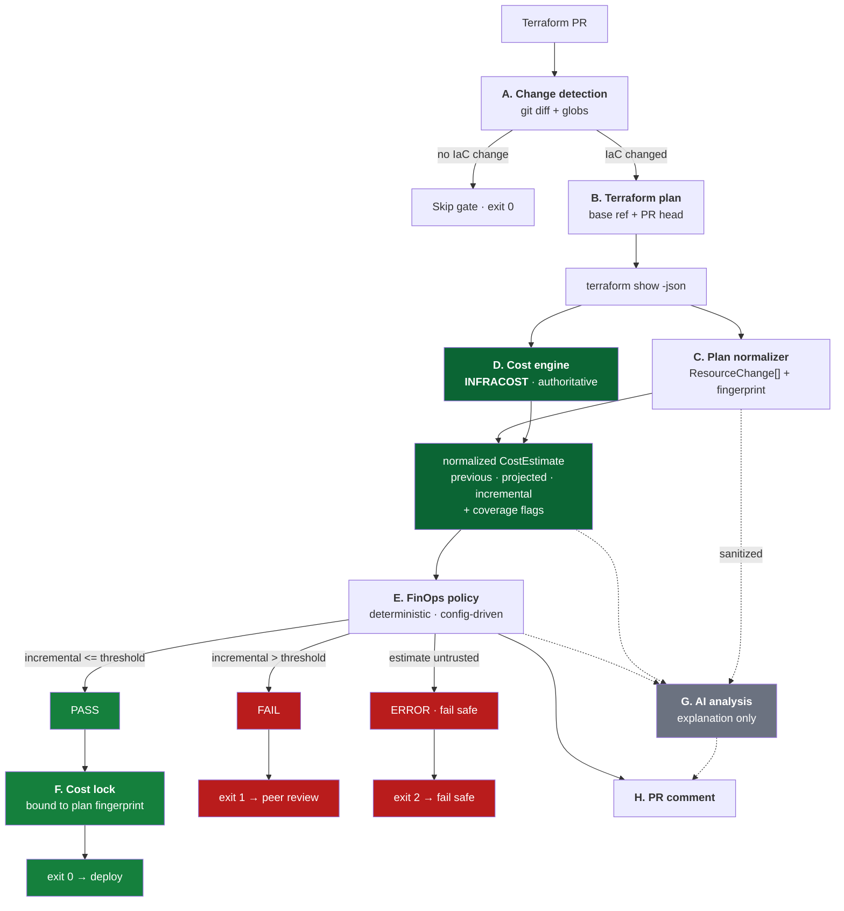

# Shift-Left FinOps — Terraform PR Cost Governance

Blocks pull requests whose estimated cloud cost increase exceeds a configurable FinOps threshold, and freezes the approved estimate as an auditable artifact when it doesn't.

Works across **AWS, Azure and GCP**. Cost figures come from **Infracost**; AI only explains them.

```
Terraform PR → detect IaC change → terraform plan → Infracost → normalized CostEstimate
    → FinOps policy → PASS (lock cost, continue) │ FAIL (block build, peer review)
```

**Status:** working POC. All 189 tests pass; all 6 demo scenarios verified against live Infracost v2.16.2.

---

## Contents

- [Results](#results)
- [Architecture](#architecture)
- [How it works](#how-it-works)
- [Why Infracost](#why-infracost)
- [Quick start](#quick-start)
- [Configuration](#configuration)
- [The threshold](#the-threshold)
- [Cost lock](#cost-lock)
- [AI layer](#ai-layer)
- [Failure semantics](#failure-semantics)
- [CI/CD](#cicd)
- [Testing](#testing)
- [Security](#security)
- [Repository layout](#repository-layout)
- [Known limitations](#known-limitations)
- [Next steps](#next-steps)

---

## Results

Live Infracost run, threshold `USD 100/month`:

| Cloud | Scenario | Previous | Projected | Incremental | Result | Exit |
|---|---|---:|---:|---:|:---:|:---:|
| aws | pass | 9.19 | 74.08 | **64.89** | PASS | 0 |
| aws | fail | 9.19 | 409.17 | **399.98** | FAIL | 1 |
| azure | pass | 9.99 | 74.88 | **64.89** | PASS | 0 |
| azure | fail | 9.99 | 874.05 | **864.06** | FAIL | 1 |
| gcp | pass | 26.46 | 61.72 | **35.26** | PASS | 0 |
| gcp | fail | 26.46 | 831.39 | **804.93** | FAIL | 1 |

Reproduce: `python scripts/demo.py` (live) or `python scripts/demo.py --fixtures` (offline).

---

## Architecture



**8 of 9 components are entirely cloud-agnostic.** The only cloud-aware logic is a resource-type prefix mapping (`aws_` / `azurerm_` / `google_`) used for grouping and reporting — never for money. There are no SKU tables, region multipliers or per-cloud pricing modules in this repository.

---

## How it works

### 1. Change detection
`finops detect-changes --base <ref>` runs `git diff --name-only` and matches against `change_detection.infrastructure_globs`. A docs-only PR skips the gate entirely.

### 2. Terraform plan
The pipeline plans **twice** — once on the base branch (baseline cost) and once on the PR head (proposed cost):

```bash
terraform plan -out tfplan.binary
terraform show -json tfplan.binary > plan.json
```

### 3. Plan normalization
`plan.json` becomes a cloud-agnostic `ResourceChange[]` plus a **plan fingerprint** (SHA-256 over the sorted, cost-relevant change set). Terraform's `["delete","create"]` collapses to `replace`; data sources and no-ops are dropped.

### 4. Cost estimation — Infracost
Infracost prices both plan JSONs; the engine subtracts:

```
incremental_monthly_cost = cost(proposed plan) − cost(baseline plan)
```

> **Why two runs?** Verified against CLI v2.16.2: `infracost scan` produces a *breakdown only* and has no `--compare-to` flag (`infracost scan --help`). The classic `diffTotalMonthlyCost` field belongs to the v0.10 schema. The two-run subtraction is identical on both CLI lines and maps exactly onto "incremental cost introduced by this PR".

The parser handles **both** Infracost schemas and auto-detects which:

| CLI | Command | Schema |
|---|---|---|
| v2 (default) | `infracost scan <plan.json> --json` | snake_case: `summary.total_monthly_cost`, `projects[].resources[].cost_components[]` |
| v0.10 | `infracost breakdown --path <plan.json> --format json` | camelCase: `totalMonthlyCost`, `projects[].breakdown.resources[].costComponents[]` |

All Infracost money fields are JSON **strings or `null`**. They are parsed with `Decimal`, and `null` is treated as *unpriced* — never coerced to `0`.

### 5. Policy → 6. Lock → 7. PR comment
Covered below.

---

## Why Infracost

| Criterion | Infracost | Native pricing APIs | Hand-maintained price book |
|---|---|---|---|
| Terraform plan → cost | Native | Build it yourself ×3 | Build it yourself ×3 |
| Multi-cloud, one interface | AWS + Azure + GCP | One API per cloud | One table per cloud |
| Resource coverage | 1,100+ | Raw SKUs, no resource mapping | Whatever you hand-write |
| Price freshness | Maintained upstream | Live | Stale within weeks |
| Coverage signal | Explicit (`is_supported`, `priceNotFound`) | None | None |
| Cost | **Free tier: 1,000 runs/month** | Free | "Free", high maintenance |
| Licence | Apache-2.0 | — | — |

Sources: [pricing](https://www.infracost.io/pricing/) · [FAQ](https://www.infracost.io/docs/faq/) · [plan JSON docs](https://www.infracost.io/docs/features/terraform_plan_json/) · [JSON schema](https://github.com/infracost/infracost/blob/master/schema/infracost.schema.json) · [repo](https://github.com/infracost/infracost)

The hard part of cloud pricing is translating `aws_instance` + `instance_type` + `root_block_device` + tenancy + OS into the right SKUs, for every resource type, in three clouds. Infracost already solves that. Native pricing APIs return raw SKU price points and would require rebuilding it three times.

> **Prospective vs. actual.** Infracost and the native *pricing* APIs return **list prices for a proposed change**. AWS Cost Explorer / Azure Cost Management / GCP Billing Export return **actual historical spend**. This gate is prospective and never uses an actual-cost API as a pricing engine.

---

## Quick start

### Prerequisites

| Tool | Version | Needed for |
|---|---|---|
| Python | ≥ 3.10 | The engine |
| Terraform | ≥ 1.5 | Generating plan JSON |
| Infracost CLI | v2.x (or v0.10.x) | Cost estimation |

### Install

```bash
git clone <repo> && cd "FinOps Cost Engine POC"
pip install -e ".[dev]"
```

Install Infracost and get a **free** API key:

```bash
# macOS: brew install infracost | Windows: choco install infracost
# Linux: curl -fsSL https://raw.githubusercontent.com/infracost/cli/master/scripts/install.sh | sh
infracost auth login
infracost org switch <your-org>
```

> Infracost has disabled GitHub/Google signup — register with email + password at [dashboard.infracost.io](https://dashboard.infracost.io) first.

### Run the demo

```bash
python scripts/demo.py              # all 6 scenarios, live Infracost
python scripts/demo.py --fixtures   # offline, replays golden fixtures
```

### Run a single gate

```bash
finops analyze \
  --plan          examples/plans/aws-pass.json \
  --baseline-plan examples/plans/aws-baseline.json \
  --commit "$(git rev-parse HEAD)" \
  --execution-id  local-001
```

### Regenerate plan JSON from Terraform

```bash
python scripts/generate_plans.py --cloud all       # AWS + GCP plan offline
python scripts/synthesize_azure_plans.py           # Azure (see limitations)
python scripts/capture_fixtures.py                 # refresh golden fixtures
```

### CLI

| Command | Purpose |
|---|---|
| `finops detect-changes --base <ref>` | Does this PR touch infrastructure? |
| `finops analyze --plan <p> [--baseline-plan <b>]` | Run the gate (exit 0/1/2) |
| `finops normalize-plan --plan <p>` | Inspect the normalized change set |
| `finops verify-lock --lock <l> --plan <p>` | Is this lock still valid for this plan? |

---

## Configuration

All policy lives in [config/finops-policy.yaml](config/finops-policy.yaml). Environment variables override it, so CI can vary policy per environment without code changes.

| Env var | Overrides |
|---|---|
| `FINOPS_THRESHOLD_VALUE` | `threshold.value` |
| `FINOPS_THRESHOLD_METRIC` | `threshold.metric` |
| `FINOPS_THRESHOLD_CURRENCY` | `threshold.currency` |
| `FINOPS_COST_ESTIMATOR` | `cost_estimation.estimator` |
| `FINOPS_AI_PROVIDER` | `ai.provider` |
| `FINOPS_OUTPUT_DIR` | `cost_lock.output_dir` |
| `FINOPS_CONFIG` | Config file path |

Credentials come from the environment only — see [.env.example](.env.example). Nothing secret is committed.

| Variable | Purpose |
|---|---|
| `INFRACOST_CLI_AUTHENTICATION_TOKEN` | Infracost CLI v2 (CI) |
| `INFRACOST_API_KEY` | Infracost CLI v0.10 |
| `AZURE_OPENAI_ENDPOINT` / `AZURE_OPENAI_API_KEY` / `AZURE_OPENAI_DEPLOYMENT` | Optional AI |
| `OPENAI_API_KEY` / `OPENAI_MODEL` | Optional AI |

---

## The threshold

**The exact business definition is still pending confirmation**, so the metric itself is configurable — not just its value.

```yaml
threshold:
  metric: incremental_monthly_cost   # POC default
  value: 100
  currency: USD
evaluation:
  equality_is_pass: true
  allow_cost_reductions: true
```

| Metric | Meaning |
|---|---|
| `incremental_monthly_cost` | Added cost per month introduced by the PR |
| `incremental_annual_cost` | `incremental_monthly_cost × 12` |
| `incremental_percentage` | Incremental cost as % of the current baseline |
| `total_monthly_cost` | Absolute projected monthly cost of the stack |

**Equality is a PASS** (documented decision):

```
incremental_cost <= threshold  →  PASS
incremental_cost >  threshold  →  FAIL
```

Set `evaluation.equality_is_pass: false` for strict `<`. Cost **reductions** always pass.

Switching metric or unit requires **no code change** — the policy engine reads it from config and the cost lock records which metric approved it.

---

## Cost lock

On PASS, the approved estimate is frozen for that CI/CD execution:

```json
{
  "schema_version": "1.0",
  "lock_id": "b3c185a4-027e-4f34-b415-6d0bca1498cd",
  "status": "APPROVED",
  "commit": "4f2a9c1e8b7d",
  "execution_id": "17482910",
  "timestamp": "2026-09-01T16:22:41Z",
  "plan_fingerprint": "sha256:9f2c…",
  "currency": "USD",
  "estimated_previous_monthly_cost": 9.19,
  "estimated_new_monthly_cost": 74.08,
  "estimated_incremental_monthly_cost": 64.89,
  "threshold": 100.0,
  "threshold_metric": "incremental_monthly_cost",
  "estimator": "infracost (v2 schema)",
  "estimator_version": "2.16.2",
  "estimator_trust": "AUTHORITATIVE",
  "integrity": "sha256:…"
}
```

Two protections:

- **Plan fingerprint binding** — the lock is tied to a hash of the normalized change set. Edit the Terraform and the fingerprint changes, so the old approval is rejected and a new estimate is required.
- **Integrity hash** — over the canonical lock body. Hand-editing the approved figure invalidates it.

```bash
finops verify-lock --lock .finops/cost-lock.json --plan examples/plans/aws-pass.json
```

`verify-lock` also rejects a lock if the threshold or metric changed since approval.

### Trust gate

`CostEstimate` carries `trust: AUTHORITATIVE | NON_AUTHORITATIVE`. The lock writer **raises** on a non-authoritative estimate unless `cost_estimation.allow_non_authoritative_lock: true`. A test double cannot approve a deployment — that is enforced in code, not by convention.

---

## AI layer

AI receives the sanitized change plus the **already-computed** cost result and policy decision. It returns a schema-validated JSON object:

```json
{ "summary": "...", "reason": "...", "cost_drivers": ["..."], "recommendation": "..." }
```

The schema uses `additionalProperties: false` and has **no monetary fields at all** — the model is structurally unable to supply a cost figure. Every number in the final report comes from the deterministic estimate.

| Provider | Notes |
|---|---|
| `mock` | Deterministic, offline, no credentials. Default. |
| `azure_openai` | `AZURE_OPENAI_*` env vars |
| `openai` | `OPENAI_API_KEY` |

**AI failure never changes the gate.** `ai.factory.analyze()` cannot raise; on failure it returns an `available: false` result and the deterministic decision stands. Tests assert this for both PASS and FAIL paths.

---

## Failure semantics

| Failure | Category | Result | Exit | Lock |
|---|---|---|:---:|:---:|
| `terraform plan` fails | `INFRASTRUCTURE_VALIDATION` | ERROR | 2 | No |
| Plan JSON malformed / bad `format_version` | `INFRASTRUCTURE_VALIDATION` | ERROR | 2 | No |
| Terraform reported `errored: true` | `INFRASTRUCTURE_VALIDATION` | ERROR | 2 | No |
| Infracost binary missing | `COST_ESTIMATION` | ERROR | 2 | No |
| Infracost not authenticated | `COST_ESTIMATION` | ERROR | 2 | No |
| Infracost total is `null` | `COST_ESTIMATION` | ERROR | 2 | No |
| Currency mismatch | `CONFIGURATION` | ERROR | 2 | No |
| Threshold config invalid | `CONFIGURATION` | ERROR | 2 | No |
| Unsupported resource | `COST_ESTIMATION` | PASS + warning¹ | 0 | Yes, with caveat |
| No price available | `COST_ESTIMATION` | PASS + warning¹ | 0 | Yes, with caveat |
| Usage-based resource | `COST_ESTIMATION` | PASS + warning | 0 | Yes, with caveat |
| **Cost > threshold** | `POLICY` | **FAIL** | **1** | **No** |
| **Cost ≤ threshold** | `POLICY` | **PASS** | **0** | **Yes** |
| AI unavailable / malformed | `AI` | **Unchanged** | — | Yes |

¹ Configurable to `BLOCK` via `fail_safe.on_unsupported_resource` / `on_unknown_cost_resource`.

Only `POLICY` produces a *business* failure. Everything else that can't be trusted exits 2 and fails safe. **No path approves a deployment whose cost is unknown.**

---

## CI/CD

GitHub Actions, two workflows:

| Workflow | Trigger | Purpose |
|---|---|---|
| [.github/workflows/finops-cost-gate.yml](.github/workflows/finops-cost-gate.yml) | PR touching `terraform/**` | The gate |
| [.github/workflows/tests.yml](.github/workflows/tests.yml) | Push / PR | Test suite on 3.10 + 3.12 |

Gate flow: `detect-changes` → matrix `cost-gate` (only clouds the PR touched) → `deploy` (runs only if the gate succeeded).

Each cost-gate job checks out **both** the base branch and the PR head, plans both, runs `finops analyze`, posts/updates a sticky PR comment per cloud, uploads `.finops/` as a 90-day artifact, and finally translates the exit code into a job result.

Business logic lives in the Python package; the workflow only orchestrates — so the same engine runs unchanged in any CI system.

### Test infrastructure destruction

[.github/workflows/terraform-test-destroy.yml](.github/workflows/terraform-test-destroy.yml) is a separate, **manual-only** (`workflow_dispatch`) workflow for intentionally tearing down a deployable test stack such as `web-platform` in `dev`. It is never part of the FinOps Cost Gate and never runs on push or pull_request.

- Requires typing `DESTROY` (exact match) plus choosing the stack/environment from fixed, registry-backed dropdowns — no free-text Terraform directory can be entered.
- Uses the same GitHub OIDC deploy role and remote S3 backend/state convention as `finops-cost-gate.yml`'s `deploy` job (state key resolved only from `config/finops-stacks.yml`, never hand-typed).
- A `terraform plan -destroy` is generated and uploaded as an artifact *before* any approval is requested; a human then reviews it and approves via the `finops-destroy-approval` GitHub Environment (never a PR comment — there is no PR here).
- The `destroy` job re-verifies the downloaded plan's SHA-256 fingerprint and stack/environment metadata against what was approved, then applies **exactly** that saved plan — it never re-plans immediately before applying.
- Structurally cannot destroy the backend/IAM/OIDC bootstrap infrastructure or the Terraform state bucket itself — it only ever touches the selected workload's own Terraform root and state key.

### Required repository settings

| Type | Name | Notes |
|---|---|---|
| Secret | `INFRACOST_API_KEY` | Free key from `infracost auth login` |
| Variable | `FINOPS_THRESHOLD_VALUE` | Optional, defaults to `100` |
| Variable | `FINOPS_THRESHOLD_METRIC` | Optional |
| Variable | `FINOPS_AI_PROVIDER` | Optional, defaults to `mock` |
| Secret | `AZURE_OPENAI_*` | Only for real AI |

Cloud credentials are needed **only** by `terraform plan`, never by the engine. The workflow has commented-out OIDC steps; the POC stacks use mock credentials instead.

---

## Testing

```bash
pytest                    # 189 tests
pytest -m unit            # 120
pytest -m integration     # 37
pytest -m e2e             # 32
```

All tests run **offline** — no Infracost binary, API key or network.

| Layer | Covers |
|---|---|
| **unit** | Plan normalization, fingerprinting, both Infracost schemas, policy engine, cost lock, config, sanitizer, AI schema |
| **integration** | Golden Infracost JSON → `CostEstimate` → policy, for all three clouds |
| **e2e** | Full gate: PASS→lock→continue, FAIL→no lock→block |

The **authoritative** Infracost parser is tested against `tests/fixtures/infracost/*.json` — real output captured from genuine runs by `scripts/capture_fixtures.py`. The `MockEstimator` is used only where the number itself is irrelevant, and cannot produce a lock.

Edge cases covered: cost exactly equal to threshold (PASS), one cent over (FAIL), cost reduction, resource deletion, multiple resources, multiple clouds, unsupported resource, usage-based resource, `null` total, missing plan, estimation failure, stale lock after plan change, tampered lock, AI failure on both paths.

---

## Security

- **No secrets in source control.** Credentials come from env vars; [.env.example](.env.example) documents them; `.gitignore` excludes `.env`, `*.tfstate`, `*.pem`, `*.key`.
- **Infracost receives no plan file, no credentials.** Per Infracost's FAQ it sends only cost-determining attributes (instance type, region, tenancy) to `pricing.api.infracost.io`.
- **Separate AI trust boundary.** [src/finops/plan/sanitizer.py](src/finops/plan/sanitizer.py) applies an allowlist of ~50 cost-relevant attributes, then redacts anything matching sensitive patterns (`password`, `secret`, `token`, `private_key`, `user_data`, …) including nested keys, truncates long strings, and caps list length. A test asserts no SSH key or secret material appears in the AI payload.
- **Terraform state treated as sensitive** — never sent anywhere.
- The committed Azure SSH **public** key is a throwaway; its private half was discarded. Public keys are not secrets.

---

## Repository layout

```
├── config/finops-policy.yaml        # the ONLY place the threshold is defined
├── src/finops/
│   ├── models.py errors.py config.py cli.py gate.py
│   ├── plan/      detector · normalizer · sanitizer
│   ├── cost/      base · factory · mock_estimator · fixture_estimator
│   │   └── infracost/   runner · parser · estimator      ← authoritative
│   ├── policy/engine.py
│   ├── lock/cost_lock.py
│   ├── ai/        base · schema · mock_provider · providers · factory
│   └── report/markdown.py
├── terraform/{aws,azure,gcp}/       # main.tf + variables.tf + scenarios/*.tfvars
├── examples/plans/                  # 9 Terraform plan JSON files
├── tests/{unit,integration,e2e}/    # + fixtures/infracost/ golden files
├── scripts/                         # generate_plans · capture_fixtures · demo
├── .github/workflows/
└── docs/ARCHITECTURE.md
```

---

## Known limitations

| # | Limitation | Impact | Mitigation |
|---|---|---|---|
| 1 | **Azure plan JSON is synthesized.** The `azurerm` provider authenticates against Entra ID when configured, so unlike AWS/Google it cannot plan offline. | Azure demo uses [scripts/synthesize_azure_plans.py](scripts/synthesize_azure_plans.py) output, in Terraform's documented format. | With real Azure credentials, `python scripts/generate_plans.py --cloud azure` produces genuine plans. Infracost prices both identically. |
| 2 | List prices only — no EDP/EA/CUD/RI discounts. | Estimates are conservative. | Infracost Cloud custom price books (paid tier). |
| 3 | Usage-based resources (S3, Lambda) estimated from assumptions. | Flagged as `usage_based`, warned in the PR comment and recorded in the lock. | Infracost usage files. |
| 4 | The lock records the approved estimate; it does not reconcile against actual spend. | By design — matches the stated requirement. | Listed under next steps. |
| 5 | Baseline = `terraform plan` of the base branch. Drift between state and reality is not detected (`-refresh=false`). | Baseline may differ from live spend. | Drop `-refresh=false` when real credentials are available. |
| 6 | Sustained-use discounts not modelled for GCP. | GCP estimates run high. | Inherent to list pricing. |
| 7 | Free tier is 1,000 Infracost runs/month. | Large orgs may exceed it. | Paid tier, or the source-control integration. |

---

## Next steps

1. **Confirm the threshold definition** — monthly vs. annualized vs. percentage, and whether it varies by environment. Only a config change.
2. **Per-environment policy** — stricter thresholds for prod than dev.
3. **OIDC federation** for `terraform plan` — remove mock credentials entirely.
4. **Real Azure plans** in CI once credentials exist; delete the synthesizer.
5. **Approval workflow** — on FAIL, auto-request review from a FinOps group rather than only failing.
6. **Lock persistence** beyond the run — object storage keyed by commit, so `terraform apply` can re-verify the lock immediately before deploying.
7. **Actual-vs-estimated reconciliation** — explicitly out of scope for this POC; would consume Cost Explorer / Cost Management / Billing Export after deployment.
8. **Usage files** for realistic S3/Lambda/Cosmos estimates.
9. **Policy-as-code** — express the threshold in OPA/Rego if wider governance rules are needed.
10. **Multi-repo rollout** — package the workflow as a reusable GitHub Actions workflow.
