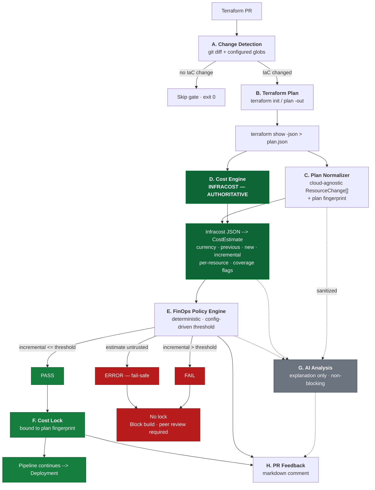

# Shift-Left FinOps Cost Governance — Revised Architecture

> **Status:** IMPLEMENTED AND VERIFIED — 189 tests passing, 6/6 demo scenarios validated against live Infracost v2.16.2
> **Date:** 2026-09-01
> **Scope:** Terraform PR cost governance across AWS, Azure and GCP
> **CI/CD:** GitHub Actions (Jenkins explicitly out of scope)

---

## Table of Contents

1. [Correction to the earlier design](#1-correction-to-the-earlier-design)
2. [Verified Infracost facts](#2-verified-infracost-facts)
3. [Verified Infracost JSON contract](#3-verified-infracost-json-contract)
4. [Revised architecture](#4-revised-architecture)
5. [Exactly where Infracost sits](#5-exactly-where-infracost-sits)
6. [What is mocked, and what it may never do](#6-what-is-mocked-and-what-it-may-never-do)
7. [What needs real credentials / network](#7-what-needs-real-credentials--network)
8. [Failure semantics](#8-failure-semantics)
9. [Repository structure](#9-repository-structure)
10. [Current repo state](#10-current-repo-state)
11. [Resolved decisions](#11-resolved-decisions)
12. [Implementation status](#12-implementation-status)

---

## 1. Correction to the earlier design

My first pass described Infracost as *"a paid/account dependency, unsuitable as the only engine"* and proposed manually maintained AWS/Azure/GCP price books as the default pricing source.

**That characterisation was wrong**, and the price-book approach has been removed.

### Why the price-book approach was wrong

| Problem | Consequence |
|---|---|
| Hand-maintained SKU tables go stale immediately | Cloud providers change prices continuously; a committed JSON price list is wrong within weeks |
| Region multipliers were an invented approximation | Not a real price — fabricated precision presented as authoritative |
| ~60 instance types vs. Infracost's 1,100+ resources | Almost every real PR would hit "unsupported resource" |
| Per-cloud pricing code in `providers/aws|azure|gcp` | Exactly the tight coupling the requirement said to avoid |
| No coverage signal | No way to know whether a resource was genuinely free or silently unpriced |

`config/pricing/aws.json`, `azure.json` and `gcp.json` have been **deleted**. There is no manually maintained price data anywhere in the repository.

---

## 2. Verified Infracost facts

All confirmed from official sources on 2026-09-01.

| Fact | Source |
|---|---|
| **Apache-2.0 open source** | [github.com/infracost/infracost](https://github.com/infracost/infracost) — License: Apache-2.0 |
| **Infracost CI/CD tier is Free** — 1,000 runs/month | [infracost.io/pricing](https://www.infracost.io/pricing/) |
| **Free API key** via `infracost auth login` | [Jenkins docs](https://www.infracost.io/docs/integrations/jenkins/) — *"run `infracost auth login` to get a free API key"* |
| Supports **AWS, Azure and Google** — 1,100+ resources | [FAQ — Features](https://www.infracost.io/docs/faq/) |
| **Terraform plan JSON is a first-class input** | [Terraform Plan docs](https://www.infracost.io/docs/features/terraform_plan_json/) |
| **No cloud credentials** and **no plan file** sent to the pricing API | [FAQ — Security & Privacy](https://www.infracost.io/docs/faq/) |
| Official **Jenkins** integration + example Jenkinsfiles | [infracost/infracost-jenkins](https://github.com/infracost/infracost-jenkins) |
| Machine-readable JSON incl. `diffTotalMonthlyCost` | [infracost.schema.json](https://raw.githubusercontent.com/infracost/infracost/master/schema/infracost.schema.json) |
| Current CLI **v2.16.0**; legacy line **v0.10.45** | [Get started](https://www.infracost.io/docs/) · [Releases](https://github.com/infracost/infracost/releases) |

### Free vs. paid — what the POC actually needs

| Tier | Price | Contents | Needed by POC? |
|---|---|---|---|
| **Infracost CI/CD** | **Free** | Cost estimation for Terraform/CloudFormation/CDK, GitHub/GitLab/Azure DevOps integration, **1,000 runs/month**, community support | ✅ **This is all we need** |
| Starter | $250/mo | 10,000 runs/month, email support | ❌ |
| Cloud | $1,000/mo | FinOps policies, guardrails, dashboards, custom price books | ❌ (we implement our own policy engine) |
| Enterprise | Contact | SSO/SAML, SKU overrides, SLAs | ❌ |

The POC's FinOps threshold gate, cost lock and CI/CD blocking are **implemented by us**, not bought from Infracost Cloud. Only the free CLI + free pricing API are consumed.

### Why Infracost over native cloud pricing APIs

| Criterion | Infracost | AWS Price List API | Azure Retail Prices | GCP Billing Catalog |
|---|---|---|---|---|
| Terraform plan → cost | ✅ Native | ❌ Build it yourself | ❌ Build it yourself | ❌ Build it yourself |
| Multi-cloud, one interface | ✅ | ❌ AWS only | ❌ Azure only | ❌ GCP only |
| Resource coverage | 1,100+ | Raw SKUs, no resource mapping | Raw SKUs | Raw SKUs |
| Incremental/diff cost | ✅ `diffTotalMonthlyCost` | ❌ | ❌ | ❌ |
| Auth | Free API key | SigV4 (AWS creds) | Anonymous | API key |
| Effort to reach parity | — | Very high ×3 | Very high ×3 | Very high ×3 |

Native pricing APIs return **raw SKU price points**. Translating `aws_instance` + `instance_type` + `root_block_device` + tenancy + OS into the right SKUs — for every resource type, in three clouds — *is* the hard part, and it is precisely what Infracost already solves.

> **Important distinction preserved:** Infracost and the native *pricing* APIs give **prospective list prices** for a proposed change. AWS Cost Explorer / Azure Cost Management / GCP Billing Export give **actual historical spend**. This gate is prospective — it never uses an actual-cost API as a pricing engine.

---

## 3. Verified Infracost JSON contract

From [`schema/infracost.schema.json`](https://raw.githubusercontent.com/infracost/infracost/master/schema/infracost.schema.json). This is the exact interface the engine consumes.

```text
Root
├── version, currency, timeGenerated, metadata
├── totalMonthlyCost              ← projected cost      (string | null)
├── pastTotalMonthlyCost          ← existing cost       (string | null)
├── diffTotalMonthlyCost          ← INCREMENTAL — the number the gate evaluates
├── totalHourlyCost / pastTotalHourlyCost / diffTotalHourlyCost
├── summary
│   ├── totalDetectedResources / totalSupportedResources
│   ├── totalUnsupportedResources / totalNoPriceResources
│   ├── totalUsageBasedResources
│   └── unsupportedResourceCounts{} / noPriceResourceCounts{}
└── projects[]
    ├── name, displayName
    ├── metadata { path, type, errors[], warnings[], currentErrors[], pastErrors[] }
    ├── pastBreakdown  → Breakdown
    ├── breakdown      → Breakdown
    ├── diff           → Breakdown
    └── Breakdown
        ├── totalMonthlyCost, totalHourlyCost, totalMonthlyUsageCost
        ├── freeResources[]
        └── resources[] → Resource
            ├── name, resourceType, tags{}, defaultTags{}
            ├── monthlyCost, hourlyCost, monthlyUsageCost
            ├── subresources[]
            └── costComponents[] → CostComponent
                ├── name, unit
                ├── monthlyQuantity, hourlyQuantity
                ├── price, monthlyCost, hourlyCost
                ├── usageBased      (bool)
                └── priceNotFound   (bool)
```

### Two contract details that drive the design

**1. All money fields are `string` or `null` — never numbers.**

```python
Decimal(str(value))     # correct
float(value)            # loses precision
value or 0              # WRONG — null is "unpriced", not "free"
```

A `null` total means *Infracost could not price this*. Coercing it to `0` would silently approve an unpriced change. The engine treats `null` as a fail-safe signal.

**2. Coverage is reported explicitly.**

`summary.totalUnsupportedResources`, `summary.noPriceResourceCounts`, `costComponents[].priceNotFound` and `costComponents[].usageBased` mean the engine **never has to guess** whether a resource was priced. This is a capability the price-book approach could not provide.

---

## 4. Revised architecture



### The pipeline in one line

```text
Terraform Plan JSON → Infracost → normalized CostEstimate → FinOps Policy → PASS/FAIL → Cost Lock
                                                                   ↓
                                                         AI explanation (advisory)
```

### Key change vs. the previous design

There is now **zero cloud-specific pricing code**.

| Removed | Replaced by |
|---|---|
| `config/pricing/aws.json` (60+ SKUs) | Infracost Cloud Pricing API |
| `config/pricing/azure.json` | Infracost Cloud Pricing API |
| `config/pricing/gcp.json` | Infracost Cloud Pricing API |
| `cost/providers/aws.py` | — not needed |
| `cost/providers/azure.py` | — not needed |
| `cost/providers/gcp.py` | — not needed |
| Region multiplier tables | Infracost prices the real region |

The engine's **only** cloud-aware logic is a trivial provider→cloud string mapping (`aws_*` → aws, `azurerm_*` → azure, `google_*` → gcp) used for **grouping and reporting**, never for money. This is what makes the core genuinely provider-agnostic rather than AWS-first with bolt-ons.

---

## 5. Exactly where Infracost sits

Infracost is an **adapter behind a port**, and it is the **only authoritative implementation**.

```text
src/finops/cost/
├── base.py                     # CostEstimator port + EstimatorTrust enum
├── infracost/
│   ├── runner.py               # subprocess invocation, v2 + v0.10 compatible
│   ├── parser.py               # infracost.schema.json -> CostEstimate   [AUTHORITATIVE]
│   └── estimator.py            # primary adapter · trust = AUTHORITATIVE
├── fixture_estimator.py        # replays RECORDED real Infracost JSON     [AUTHORITATIVE parse path]
├── mock_estimator.py           # tiny table · trust = NON_AUTHORITATIVE   [TESTS ONLY]
└── factory.py                  # selects by config; refuses mock unless explicitly allowed
```

### 5.1 Invocation

Infracost consumes the **same `plan.json` that Terraform already produces** — no duplicate work, no second parse of HCL:

```bash
# Terraform produces the plan (this stage already exists in most pipelines)
terraform plan -out tfplan.binary
terraform show -json tfplan.binary > plan.json

# Infracost prices it
infracost scan plan.json --json > infracost.json                              # CLI v2
infracost breakdown --path plan.json --format json --out-file infracost.json  # CLI v0.10
```

`runner.py` probes `infracost --version` **once** and selects the command form, so the POC works with both the current **v2.x** CLI (`scan`) and the **v0.10.x** line still shipped in the `infracost/infracost:ci-0.10` Docker image.

Per the official docs, Infracost detects a plan JSON **by content** (`format_version` + `planned_values` keys), so the filename is irrelevant, and it does **not** run Terraform, download modules or read variables when given a plan JSON.

### 5.2 How incremental cost is derived — VERIFIED

**Finding (CLI v2.16.2, confirmed by `infracost scan --help`):** v2's `scan` produces a **breakdown only**. It has no `--compare-to` or diff flag, and its JSON contains no `diffTotalMonthlyCost` / `pastTotalMonthlyCost`. Those fields belong to the **v0.10** schema.

**Decision: two-run subtraction.**

```
incremental_monthly_cost = cost(proposed plan.json) − cost(baseline plan.json)
```

| Property | Why it matters |
|---|---|
| Identical on v2 and v0.10 | One code path, no version-specific diff logic |
| Maps exactly onto the requirement | "Incremental cost introduced by a PR" = head cost − base cost |
| Independent of prior state in the plan | Works whether or not the plan carries `prior_state` |
| Auditable | Both raw Infracost documents are persisted to `.finops/` |

When no baseline plan is supplied, previous cost is treated as `0` **and a warning is recorded**, so a greenfield estimate is never mistaken for an incremental one.

### 5.3 Normalization mapping

`parser.py` converts either Infracost schema into the cloud-agnostic `CostEstimate`:

| Engine field | v2 source (`scan --json`) | v0.10 source (`breakdown`) |
|---|---|---|
| `currency` | `currency` | `currency` |
| `new_monthly_cost` | `summary.total_monthly_cost` | `totalMonthlyCost` |
| `previous_monthly_cost` | same field, from the **baseline run** | same field, baseline run |
| **`incremental_monthly_cost`** | **proposed − baseline** | **proposed − baseline** |
| per-resource cost | `projects[].resources[].cost_components[]` (+ recursive `subresources`) | `projects[].breakdown.resources[].costComponents[]` |
| `cloud` tag | `resources[].type` prefix | `resources[].resourceType` prefix |
| unsupported | `resources[].is_supported == false`, or `resources − costed − free` | `summary.totalUnsupportedResources` |
| unpriced | `price`/`total_monthly_cost` is `null` | `costComponents[].priceNotFound` |
| usage-based | `cost_components[].usage_monthly_cost != 0` | `costComponents[].usageBased` |

A `null` total for either run raises `CostEstimationError` → **fail-safe BLOCK**. `null` is never coerced to `0`.

> **Subresource nuance.** Infracost v2 marks nested blocks such as `root_block_device` as `is_supported: false` even when it prices them. The parser folds subresource components into the parent's total and only treats a **top-level resource with no priced component** as genuinely uncovered — otherwise every EC2 instance would falsely report an unsupported resource.

### 5.4 The trust gate — structural safety

`CostEstimate` carries a trust marker:

```python
class EstimatorTrust(str, Enum):
    AUTHORITATIVE     = "AUTHORITATIVE"      # Infracost
    NON_AUTHORITATIVE = "NON_AUTHORITATIVE"  # mock
```

The cost-lock writer **refuses** to emit an approval artifact from a `NON_AUTHORITATIVE` estimate unless `cost_estimation.allow_non_authoritative_lock: true` is explicitly set in config.

> This makes it **structurally impossible** for a mock number to silently approve a deployment. It is not a convention or a code-review rule — the lock writer raises.

---

## 6. What is mocked, and what it may never do

| Component | Authoritative? | Used by | Network/creds? |
|---|---|---|---|
| `InfracostEstimator` | ✅ **Yes** | CI/CD, local runs, the demo | Infracost API key + HTTPS to `pricing.api.infracost.io` |
| `InfracostFixtureEstimator` | ✅ **Yes** (parse path) | Integration tests | ❌ — replays committed real Infracost JSON |
| `MockEstimator` | ❌ **No** | Unit + E2E policy/lock/AI tests | ❌ |
| `MockAIProvider` | N/A (advisory) | Tests + local dev | ❌ |

### The important distinction

**The authoritative Infracost → `CostEstimate` parser is tested against golden files captured from real Infracost runs.**

```text
tests/fixtures/infracost/
├── aws-below-threshold.json      # real infracost output, committed
├── aws-above-threshold.json
├── azure-below-threshold.json
├── azure-above-threshold.json
├── gcp-below-threshold.json
├── gcp-above-threshold.json
├── multi-cloud.json
├── null-diff-total.json          # edge: diffTotalMonthlyCost == null
├── unsupported-resource.json     # edge: summary.totalUnsupportedResources > 0
└── usage-based-resource.json     # edge: costComponents[].usageBased == true
```

So the **production code path is fully covered offline**. `MockEstimator` is used only where the *number itself is irrelevant* — proving that `$184 > $100 ⇒ FAIL`, that a lock is written on PASS, that fingerprint rebinding rejects a stale lock.

### Constraints on `MockEstimator`

- ~30 lines, a plain dict of a handful of SKUs
- Lives in `src/finops/cost/mock_estimator.py`
- **Never** the config default (`config/finops-policy.yaml` ships `estimator: infracost`)
- Every artifact it produces is stamped:

```json
{
  "estimator": "mock",
  "trust": "NON_AUTHORITATIVE",
  "warning": "Mock estimator — not valid for cost approval"
}
```

- Cannot produce a cost lock unless `allow_non_authoritative_lock: true`

---

## 7. What needs real credentials / network

| Stage | Needs | Cloud creds? | Notes |
|---|---|---|---|
| A. Change detection | git | ❌ | Fully offline |
| B1. `terraform init` | HTTPS to registry | ❌ | Cacheable / mirrorable |
| B2. `terraform plan` | **Cloud credentials** | ✅ **Yes** (read-only) | AWS/Azure/GCP — refreshes state. Prefer OIDC federation, no static keys |
| B3. `terraform show -json` | — | ❌ | Offline |
| **D. Infracost estimate** | **Infracost API key** + HTTPS `:443` | ❌ **No** | Free tier. Plan JSON is **not** uploaded — only cost parameters |
| C. Plan normalizer | — | ❌ | Offline |
| E. Policy engine | — | ❌ | Deterministic, offline |
| F. Cost lock | — | ❌ | Offline |
| G. AI analysis | AI endpoint + key | ❌ | **Optional** — degrades to deterministic template |
| H. PR comment | VCS token | ❌ | `GITHUB_TOKEN` or `infracost comment` |

### Network egress allowlist

From the Infracost FAQ:

| Direction | To | Host | Port | IPs |
|---|---|---|---|---|
| Outbound | Infracost | `pricing.api.infracost.io` | 443 | `76.223.127.201`, `52.223.24.69` |
| Outbound | Infracost | `dashboard.api.infracost.io` | 443 | same |

### What Infracost actually sends

Per the official FAQ, the CLI sends a GraphQL query containing **only cost-determining attributes**:

```graphql
query {
  products(filter: {
    vendorName: "aws"
    service: "AmazonEC2"
    productFamily: "Compute Instance"
    region: "us-east-1"
    attributeFilters: [
      { key: "instanceType", value: "t3.micro" }
      { key: "tenancy",      value: "Shared" }
      { key: "operatingSystem", value: "Linux" }
    ]
  }) { prices(filter: {purchaseOption: "on_demand"}) { USD } }
}
```

**Not sent:** the Terraform plan JSON, Terraform state, cloud credentials, secrets, resource names, tags or IP addresses.

This satisfies requirement §11 (Security) directly — but the engine **still** sanitizes the plan before the AI layer, because the AI provider is a separate trust boundary.

---

## 8. Failure semantics

The gate must **never** approve a deployment whose cost could not be trusted.

| Failure | Category | Gate result | Exit | Lock? | Rationale |
|---|---|---|---|---|---|
| `terraform plan` fails | `INFRASTRUCTURE_VALIDATION` | ERROR | 2 | ❌ | Nothing to price |
| Plan JSON malformed / unknown `format_version` | `INFRASTRUCTURE_VALIDATION` | ERROR | 2 | ❌ | Cannot normalize |
| Infracost binary missing | `COST_ESTIMATION` | ERROR | 2 | ❌ | Cost unknown ⇒ never approve |
| Infracost not authenticated / API unreachable | `COST_ESTIMATION` | ERROR | 2 | ❌ | Cost unknown ⇒ never approve |
| Infracost non-zero exit | `COST_ESTIMATION` | ERROR | 2 | ❌ | Cost unknown ⇒ never approve |
| Infracost total is `null` for either run | `COST_ESTIMATION` | ERROR | 2 | ❌ | **Null ≠ zero** |
| Resource reported unsupported | `COST_ESTIMATION` | PASS + ⚠️ warning *(configurable → BLOCK)* | 0 | ✅ with coverage caveat | Infracost reports it explicitly |
| No price available | `COST_ESTIMATION` | PASS + ⚠️ warning | 0 | ✅ with caveat | Recorded in the lock |
| Usage-based component | `COST_ESTIMATION` | PASS + ⚠️ warning | 0 | ✅ with caveat | Usage cost genuinely unknown at plan time |
| Threshold config missing/invalid | `CONFIGURATION` | ERROR | 2 | ❌ | Cannot evaluate policy |
| **Cost > threshold** | `POLICY` | **FAIL** | **1** | ❌ | **Block build · peer review required** |
| **Cost ≤ threshold** | `POLICY` | **PASS** | **0** | ✅ | **Lock cost · continue** |
| AI provider unreachable | `AI` | **Unchanged** | — | ✅ | AI is explanatory only |
| AI returns schema-invalid JSON | `AI` | **Unchanged** | — | ✅ | Falls back to deterministic template |

### The four failure classes are distinct

```text
INFRASTRUCTURE_VALIDATION  →  the change itself could not be planned
COST_ESTIMATION            →  the change planned, but cost is not trustworthy
POLICY                     →  cost is trustworthy and exceeds the threshold
AI                         →  explanation unavailable (never blocks)
```

Only `POLICY` produces a *business* failure (exit 1 = "too expensive, get peer review").
`INFRASTRUCTURE_VALIDATION` / `COST_ESTIMATION` / `CONFIGURATION` produce exit 2 = "cannot decide, fail safe".
`AI` never changes the outcome.

### Threshold equality

Documented decision, per requirement §13:

```text
incremental_cost <= threshold   →  PASS   (equality passes)
incremental_cost >  threshold   →  FAIL
```

Configurable via `evaluation.equality_is_pass`. Cost **reductions** (negative incremental) always pass when `evaluation.allow_cost_reductions: true`.

---

## 9. Repository structure

```text
FinOps Cost Engine POC/
│
├── config/
│   └── finops-policy.yaml          # threshold + fail-safe + estimator selection
│                                   # NO price data lives here
├── src/finops/
│   ├── __init__.py
│   ├── models.py                   # cloud-agnostic domain models
│   ├── errors.py                   # 4-class failure taxonomy
│   ├── config.py                   # YAML + env overrides
│   ├── cli.py                      # finops detect-changes | analyze | verify-lock
│   │
│   ├── plan/
│   │   ├── detector.py             # A. does this PR touch infrastructure?
│   │   ├── normalizer.py           # C. plan JSON -> ResourceChange[] + fingerprint
│   │   └── sanitizer.py            # strip secrets before the AI boundary
│   │
│   ├── cost/                       # D. cost estimation
│   │   ├── base.py                 #    CostEstimator port + EstimatorTrust
│   │   ├── infracost/
│   │   │   ├── runner.py           #    CLI invocation (v2 + v0.10)
│   │   │   ├── parser.py           #    schema -> CostEstimate  [AUTHORITATIVE]
│   │   │   └── estimator.py        #    primary adapter
│   │   ├── fixture_estimator.py    #    replay recorded Infracost JSON
│   │   ├── mock_estimator.py       #    TESTS ONLY · NON_AUTHORITATIVE
│   │   └── factory.py
│   │
│   ├── policy/engine.py            # E. deterministic threshold evaluation
│   ├── lock/cost_lock.py           # F. create + verify lock artifact
│   ├── ai/
│   │   ├── base.py                 # G. AIProvider port
│   │   ├── schema.py               #    JSON Schema for structured output
│   │   ├── mock_provider.py        #    deterministic, offline
│   │   └── azure_openai_provider.py
│   └── report/markdown.py          # I. PR comment rendering
│
├── terraform/
│   ├── aws/     main.tf · variables.tf · scenarios/{baseline,pass,fail}.tfvars
│   ├── azure/   main.tf · variables.tf · scenarios/{baseline,pass,fail}.tfvars
│   └── gcp/     main.tf · variables.tf · scenarios/{baseline,pass,fail}.tfvars
│
├── examples/plans/                 # 9 Terraform plan JSON files (committed)
│
├── tests/
│   ├── conftest.py
│   ├── fixtures/infracost/         # golden REAL Infracost JSON per scenario
│   ├── unit/                       # normalizer, parser, policy, lock, config
│   ├── integration/                # Infracost JSON -> CostEstimate -> policy
│   └── e2e/                        # full gate: PASS+lock / FAIL+block
│
├── .github/workflows/
│   ├── finops-cost-gate.yml        # the gate (GitHub Actions only)
│   └── tests.yml                   # test suite on 3.10 + 3.12
│
├── scripts/
│   ├── generate_plans.py           # terraform plan -> plan JSON (AWS, GCP)
│   ├── synthesize_azure_plans.py   # Azure stand-in (see limitations)
│   ├── capture_fixtures.py         # refresh golden Infracost JSON
│   └── demo.py                     # run all 6 scenarios
│
└── docs/ARCHITECTURE.md            # this file
```

> `config/pricing/` — **deleted**. No manually maintained price data anywhere.
> No Jenkins files — GitHub Actions is the only CI/CD implementation.

### Component responsibility map

| Req. § | Component | Module | Cloud-aware? |
|---|---|---|---|
| A | PR / change detection | `plan/detector.py` | ❌ |
| B | Terraform plan | `scripts/` + workflow | ✅ (provider auth only) |
| C | Plan normalizer | `plan/normalizer.py` | ⚠️ string prefix mapping only |
| D | Cost estimation engine | `cost/infracost/` | ❌ (Infracost handles it) |
| E | AI analysis layer | `ai/` | ❌ |
| F | FinOps policy engine | `policy/engine.py` | ❌ |
| G | Cost lock | `lock/cost_lock.py` | ❌ |
| H | CI/CD gate | `cli.py` exit codes | ❌ |
| I | PR feedback | `report/markdown.py` | ❌ |

**8 of 9 components are entirely cloud-agnostic.**

---

## 10. Current repo state

### Environment (verified 2026-09-01)

| Tool | Status |
|---|---|
| Python | ✅ 3.12.10 |
| Terraform | ✅ v1.11.0 |
| git | ✅ 2.44.0 |
| **Infracost** | ✅ **v2.16.2 installed and authenticated** (org `coforge`) |

Infracost was installed from the official `infracost/cli` release with its published SHA-256 checksum verified, to `%LOCALAPPDATA%\Programs\infracost` — no admin elevation required.

### Verified results

| Cloud | Scenario | Previous | Projected | Incremental | Result | Exit |
|---|---|---:|---:|---:|:---:|:---:|
| aws | pass | 9.19 | 74.08 | 64.89 | PASS | 0 |
| aws | fail | 9.19 | 409.17 | 399.98 | FAIL | 1 |
| azure | pass | 9.99 | 74.88 | 64.89 | PASS | 0 |
| azure | fail | 9.99 | 874.05 | 864.06 | FAIL | 1 |
| gcp | pass | 26.46 | 61.72 | 35.26 | PASS | 0 |
| gcp | fail | 26.46 | 831.39 | 804.93 | FAIL | 1 |

Offline fixture replay (`python scripts/demo.py --fixtures`) reproduces these numbers **exactly**, confirming the golden fixtures are faithful.

---

## 11. Resolved decisions

| # | Question | Decision | Evidence |
|---|---|---|---|
| 1 | Infracost API key | **Installed and authenticated.** Live golden fixtures captured. | `infracost auth whoami` → org `coforge` |
| 2 | CLI version target | **Auto-detect, default v2.** `runner.py` probes `--version`. | Parser handles both schemas; unit-tested |
| 3 | How to get incremental cost | **Two-run subtraction.** v2 `scan` is breakdown-only with no diff flag. | `infracost scan --help` |
| 4 | CI/CD platform | **GitHub Actions only.** Jenkins explicitly out of scope. | Per requirement update |
| 5 | Threshold equality | **Equality passes** (`<=`), configurable | `evaluation.equality_is_pass` |
| 6 | Azure offline plan | **Synthesized** — azurerm authenticates against Entra ID at configure time | See limitation §12 |

---

## 12. Implementation status

| Step | Deliverable | Status |
|---|---|---|
| 1 | Inspect repo, choose approach | ✅ |
| 2 | Research Infracost / Terraform / pricing APIs | ✅ |
| 3 | Architecture | ✅ this document |
| 4 | Vertical slice: plan JSON → Infracost → threshold → PASS/FAIL | ✅ verified live |
| 5 | Cost lock + fingerprint binding + verify | ✅ |
| 6 | AI analysis (schema-validated, non-blocking) | ✅ |
| 7 | Azure | ✅ |
| 8 | GCP | ✅ |
| 9 | GitHub Actions gate + test workflow | ✅ |
| 10 | PR feedback markdown | ✅ |
| 11 | 189 tests (120 unit / 37 integration / 32 e2e) | ✅ all passing |
| 12 | README + this document | ✅ |

### Edge cases covered by tests

| Case | Expected | Tested |
|---|---|---|
| Cost exactly equal to threshold | PASS | ✅ |
| One cent over threshold | FAIL | ✅ |
| Cost reduction / resource deletion | PASS, negative delta | ✅ |
| Multiple resources in one PR | Correct aggregate | ✅ |
| Unsupported resource | Warn + coverage caveat | ✅ |
| Usage-based resource | Warn | ✅ |
| Infracost total `null` | ERROR, no lock | ✅ |
| Missing plan file | ERROR, no lock | ✅ |
| Estimation failure | ERROR, no lock | ✅ |
| Mock estimator tries to approve | ERROR, no lock | ✅ |
| Stale lock after plan change | Rejected on fingerprint | ✅ |
| Tampered lock | Rejected on integrity hash | ✅ |
| AI failure on PASS and on FAIL | Decision unchanged | ✅ |
| Secrets in AI payload | None present | ✅ |

---

## Design principles held throughout

| Principle | How it is enforced |
|---|---|
| LLM is never the pricing authority | AI receives the cost result; `EstimatorTrust` marks only Infracost as authoritative |
| Business policy separate from cloud implementation | `policy/engine.py` imports nothing cloud-specific |
| Multi-cloud at the architecture level | 8 of 9 components have zero cloud awareness |
| Threshold externalized | `config/finops-policy.yaml` + env overrides; metric itself is configurable |
| Cost results machine-readable | `CostEstimate.to_dict()` → JSON artifact |
| CI/CD gate deterministic | Exit codes 0/1/2 from the policy engine, not from AI |
| Approval artifacts auditable | Cost lock: commit + execution id + timestamp + fingerprint + integrity hash |
| Fail safely | Any untrusted cost ⇒ exit 2, no lock |
| No unnecessary paid services | Infracost free CI/CD tier only |
| Don't over-engineer | Price books deleted; ~600 lines of pricing code removed |
